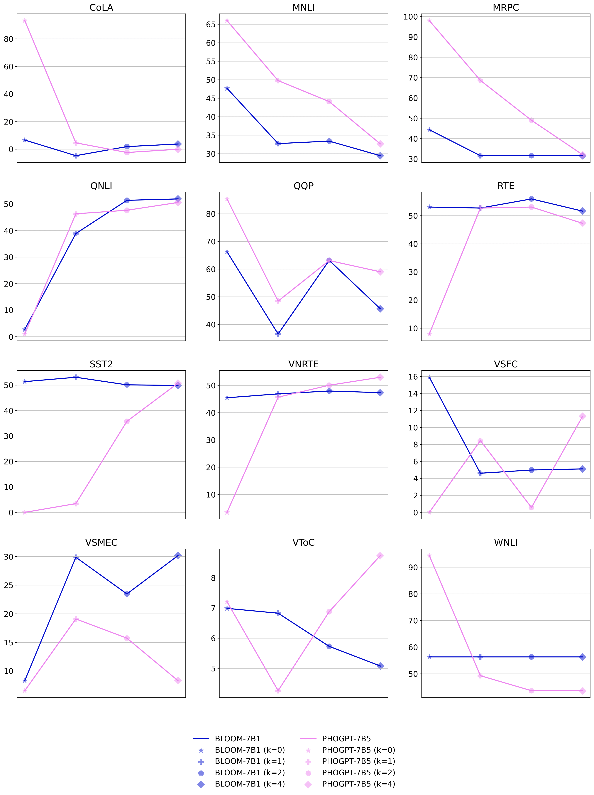

# ViGLUE: A Vietnamese General Language Understanding Benchmark and Analysis of Vietnamese Language Models

Author: Minh-Nam Tran, Phu-Vinh Nguyen, Long HB Nguyen, Dien Dinh.

---

This repository provides the source code of the publication [ViGLUE: A Vietnamese General Language Understanding Benchmark and Analysis of Vietnamese Language Models](https://aclanthology.org/2024.findings-naacl.261/).

## Introduction

ViGLUE is a Vietnamese General Language Understanding Benchmark that consists of 12 tasks, including 5 natural language inference tasks, 3 sentiment analysis tasks, 2 similarity and paraphrase tasks, and 2 single-sentence tasks. The dataset covers a wide range of domains, such as miscellaneous, Wikipedia, news, fiction books, movie reviews, student feedback, social media, and Quora QA. The dataset is constructed by translating English datasets, collecting Vietnamese data, and constructing new datasets.

## Dataset

The dataset is available at [HuggingFace - ViGLUE](https://huggingface.co/datasets/tmnam20/ViGLUE), and the Table below shows the statistics of the dataset for each task, including the train/valid/test split, the copnstructing method, the evaluation metric, and the domain of the data.

| Corpus                               | Train   | Validation | Test    | Method       | Metric  | Domain           |
| ------------------------------------ | ------- | ---------- | ------- | ------------ | ------- | ---------------- |
| **Natural Language Inference Tasks** |
| MNLI                                 | 392,702 | 9,815      | 9,796   | Translating  | Acc.    | Miscellaneous    |
| QNLI                                 | 104,743 | 5,463      | 5,463   | Translating  | Acc.    | Wikipedia        |
| RTE                                  | 2,490   | 277        | 3,000   | Translating  | Acc.    | Miscellaneous    |
| VNRTE                                | 12,526  | 3,137      | -       | Constructing | Acc.    | News             |
| WNLI                                 | 635     | 71         | 146     | Translating  | Acc.    | Fiction books    |
| **Sentiment Analysis Tasks**         |
| SST2                                 | 67,349  | 872        | 1,821   | Translating  | Acc.    | Movie reviews    |
| VSFC                                 | 11,426  | 1,538      | 3,166   | Collecting   | Acc.    | Student feedback |
| VSMEC                                | 5,548   | 686        | 693     | Collecting   | Acc.    | Social media     |
| **Similarity and Paraphrase Tasks**  |
| MRPC                                 | 3,668   | 408        | 1,725   | Translating  | Acc./F1 | News             |
| QQP                                  | 363,846 | 40,430     | 390,965 | Translating  | Acc./F1 | Quora QA         |
| **Single-Sentence Tasks**            |
| CoLA                                 | 8,551   | 1,043      | 1,063   | Translating  | MCC     | Miscellaneous    |
| VToC                                 | 7,293   | 1,831      | -       | Constructing | Acc.    | News             |

## Installation

To run the project, please use Python 3.10 and install the required packages by running the following command:

```setup
pip install -r requirements.txt
```

## Usage

This section provides the instructions to train and evaluate the models on the ViGLUE dataset.

### Evaluating Encoder-only Transformer Models

File `run_glue.py` is used to evaluate the encoder-only transformer models, such as PhoBERT, mBERT, XLM-R, and BERT. To train the models, please run the following command:

```bash
python run_glue.py \
    --model_name_or_path FacebookAI/xlm-roberta-base \
    --dataset_name tmnam20/ViGLUE \
    --task_name vsfc \
    --do_train \
    --do_eval \
    --max_seq_length 256 \
    --per_device_train_batch_size 32 \
    --per_device_eval_batch_size 32 \
    --learning_rate 2e-5 \
    --num_train_epochs 3 \
    --output_dir ./output \
    --evaluation_strategy steps \
    --eval_steps 500 \
    --logging_steps 50 \
    --save_steps 500 \
    --save_total_limit 1 \
    --cache_dir ./cache
```

where `--model_name_or_path` is the name of the model, `--task_name` is one of the 12 tasks in ViGLUE, and `--output_dir` is the directory to save the model.
The batch size, learning rate, and number of epochs can be adjusted to fit the GPU memory and the training time through the arguments `--per_device_train_batch_size`, `--learning_rate`, and `--num_train_epochs`, respectively.

### Evaluating Generative Language Models

To evaluate the generative language models, such as BLOOM, PhoGPT, Llama, please run the following command:

```bash
python eval_gen.py \
    --model_name_or_path vinai/PhoGPT-7B5 \
    --dataset_name tmnam20/ViGLUE \
    --prompt_type en \
    --task_name qqp \
    --batch_size 1 \
    --cache_dir ./cache \
    --output_filename phogpt-7b5_en-4.json \
    --evaluate_validation 1 \
    --n_shots 4 \
    --output_dir eval_results/en/phogpt
```

where `--model_name_or_path` is the name of the large language model, `--task_name` is one of the 12 tasks in ViGLUE or a list of tasks separated by commas, prompt type is `en` for English prompt (just support en for now), `--output_dir` is the directory to save the evaluation results, `--n_shots` is the number of shots for the few-shot learning evaluation, and `--output_filename` is the name of the output file to write the evaluation results.

Note that to evaluate BLOOM 176B model, we use HuggingFace API endpoint, so please make sure that you have an account and set the API key by running the following command:

```bash
export HF_TOKEN=<YOUR_HF_TOKEN>

python eval_api.py \
    --model_name_or_path bigscience/bloom \
    --dataset_name tmnam20/ViGLUE \
    --prompt_type en \
    --task_name vnrte,qnli,mnli,qqp \
    --batch_size 1 \
    --cache_dir /media/ddien/cache \
    --output_filename bloom-176b_en.json \
    --evaluate_validation 1 \
    --n_shots 0,1,2,4 \
    --output_dir eval_results/en/bloom
```

## Results

The table below shows the results of multilingual language models on the ViGLUE dataset:

| Model       | MNLI      | QNLI      | RTE       | VNRTE      | WNLI      | SST2      | VCSFC     | VSMEC     | MRPC            | QQP             | CoLA      | VToC      |
| ----------- | --------- | --------- | --------- | ---------- | --------- | --------- | --------- | --------- | --------------- | --------------- | --------- | --------- |
| Metric      | Acc.      | Acc.      | Acc.      | Acc.       | Acc.      | Acc.      | Acc.      | Acc.      | Acc./F1         | Acc./F1         | MCC       | Acc.      |
| ZeroR       | 35.45     | 50.54     | 52.71     | 53.11      | **56.34** | 50.92     | 50.85     | 31.20     | 68.38/81.22     | 63.38/0.00      | 0.00      | 6.77      |
| mBERT       | 79.66     | 89.11     | **70.76** | 99.97      | **56.34** | 88.42     | 93.62     | 53.64     | 85.29/88.85     | 89.12/85.16     | 14.13     | 81.43     |
| XLM-R_base  | 81.61     | 88.17     | 62.45     | **100.00** | **56.34** | 89.45     | 94.95     | 55.25     | 83.82/88.26     | 89.46/85.87     | 3.64      | 83.07     |
| XLM-R_large | 35.45     | **91.23** | 67.51     | **100.00** | 54.93     | **90.14** | **95.39** | 37.9      | **88.24/91.64** | **90.48/87.22** | 0.0       | **87.82** |
| mDeBERTaV3  | **83.34** | 89.99     | 69.31     | 99.97      | **56.34** | 89.79     | 95.07     | **55.39** | 86.52/90.05     | 89.98/86.69     | **19.62** | 80.88     |

For the results of Vietnamese pretrained embedding models, please refer to the paper.

The results of generative language models, which compare BLOOM 7B1 and PhoGPT-7B, are shown in the following Figure:



## Contact

If you have any questions, please contact me at tmnam20@apcs.fitus.edu.vn or trminhnam20082002@gmail.com.

## Acknowledgements

I would like to thank my advisors, Assoc. Prof. Dinh Dien and Dr. Nguyen Hong Buu Long, for their guidance and support, and my colleague, Phu-Vinh Nguyen, for his support in the project.
